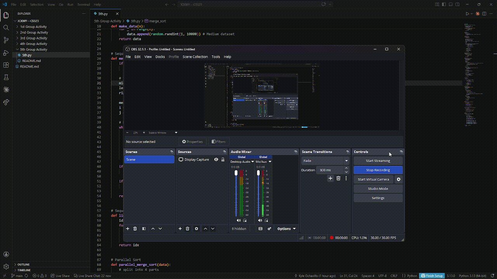

# Guide for Reflection
## - Differences observed between sequential and parallel execution
## - Performance behavior across dataset sizes
## - Challenges encountered during implementation
## - Insights about overhead, synchronization, or merging
## - Situations where parallelism was beneficial or unnecessary

### Cielo Salas
 In this activity, I learned the difference between sequential and parallel algorithms by implementing both. 
 A sequential algorithm runs step by step in a single flow, while a parallel algorithm divides the work into smaller parts that can run at the same time.
 For this task, we used merge sort as our sequential sorting algorithm and linear search for searching. 
 Then we created parallel versions by splitting the dataset into chunks and using multiple processes. 
 The parallel version was more difficult to implement because we had to manage processes and make sure the results were combined correctly.
 When we tested different dataset sizes, I noticed that parallel algorithms are not always faster. 
 For smaller datasets, the sequential version was sometimes faster because parallel execution has extra overhead like process creation and communication. 
 However, for larger datasets, the parallel version performed better since the workload was bigger and could be divided across processes.
 Overall, this activity helped me understand that parallel algorithms are useful, but not always necessary. 
 It depends on the size of the data and the cost of managing multiple processes. 
 Sequential algorithms are simpler and easier to implement, while parallel algorithms can improve performance when used properly.

### John Meinard Lumanas
 Sequential execution was simpler and easier to debug, while parallel execution allowed tasks to run simultaneously but required careful thread management and synchronization.
 In terms of performance, parallel execution showed little to no improvement on small datasets due to overhead, but provided significant speed gains as dataset size increased.
 During implementation, challenges included handling synchronization, avoiding race conditions, and ensuring that work was evenly distributed among threads.
 Additionally, overhead from thread creation, synchronization, and merging results could reduce performance benefits if not handled efficiently.
 Overall, parallelism was most useful for large, independent computations, while for smaller or simpler tasks, it was often unnecessary and sometimes even less efficient than sequential execution.

### Kyle Ochavillo
 I learned from this task that the benefits of sequential and parallel algorithms differ depending on the circumstances. While parallel versions were more difficult to execute because we had to partition the data and handle many processes, sequential algorithms like merge sort and linear search were simpler to implement because everything happens step by step. During testing, I discovered that parallel algorithms are not always quicker, on smaller datasets, they were occasionally slower because of overhead like communication and process creation. However, because the load was distributed, the parallel version performed better for bigger datasets. This helped me understand that parallelism is helpful but not always required, and that the best strategy relies on the volume of data and the cost of process control.

### Jeff Justin Bonior
 In this activity, I understood better how sequential and parallel algorithms actually behave when we implement them ourselves. 
 Sequential algorithms like merge sort and linear search were more straightforward since they follow one path from start to finish.
 When we tried the parallel versions, it became a bit more complicated because we had to split the data and run multiple processes at the same time,
 then combine the results correctly. During testing, I saw that parallel is not always faster. For smaller data, it sometimes took longer because 
 of extra work like creating processes and handling communication. But when the data became larger, the parallel version started to perform better 
 since the tasks were shared. From this, I learned that parallel algorithms can help improve performance, but only when the problem is large enough, 
 while sequential ones are still useful for simpler or smaller tasks.

 ### Yasser Tomawis
 In this implementation, I observed differences between sequential and parallel execution in terms of performance. The sequential version performed better on smaller datasets due to lower overhead, while the parallel version was more effective only for larger datasets where the workload could be divided. Although parallel merge sort showed potential speedup as dataset size increased, the improvement was limited by overhead from process creation, data splitting, and merging. A key challenge was handling multiprocessing in Python, especially function pickling and ensuring worker functions were properly defined. I also learned that synchronization and merging add computational cost that can reduce the benefits of parallelism. Overall, parallel execution is useful for large datasets but not for smaller tasks like linear search, where the overhead outweighs the gains.

# DEMO GIF
 